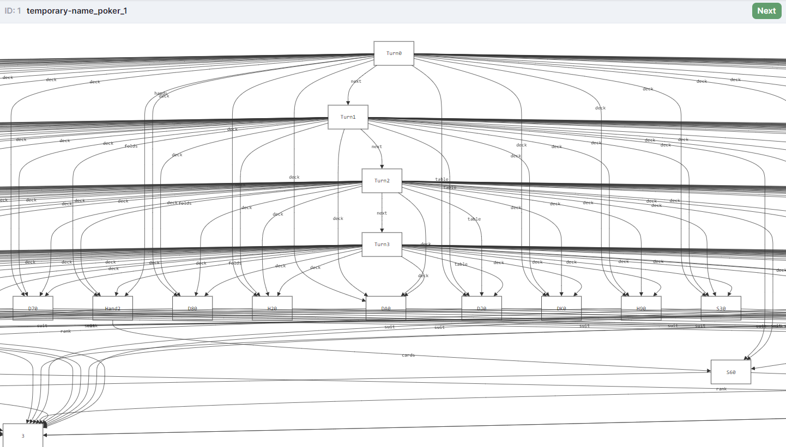
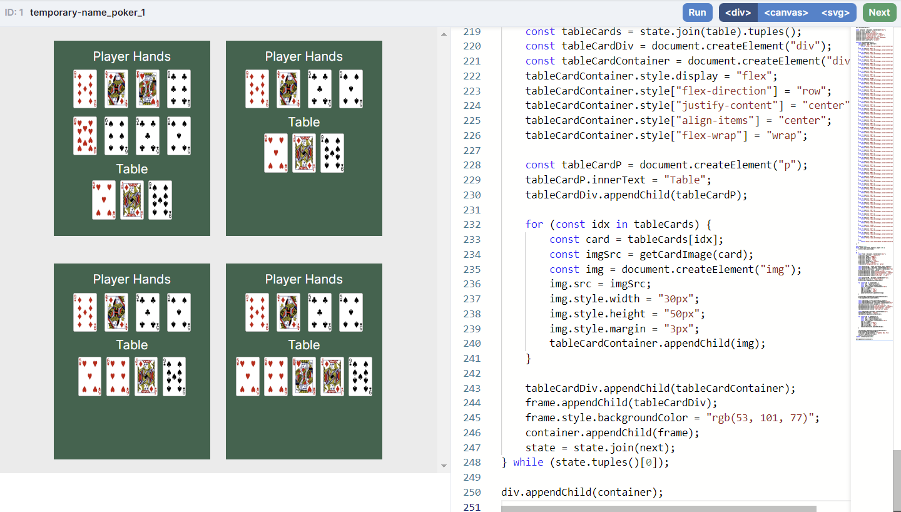

# texas-holdem
**Final project for CS1710**

## Summary
For this project, we chose to model the game of Texas Hold'em. We created a Forge model that simulates a full game, from the initial flop and dealing of cards to each player to the final card being drawn to the table with a winner decided. Alongside this model, we created a custom visualization that shows the state of the game at each turn. The overall goal of this project was to learn the inner workings of this card game through modeling and testing, and to take this knowledge beyond this class in the future, as poker is a popular game that we will encounter frequently in our lives.

## Adaptations
As we got further into the creation of our model, several of the goals we initially set out with changed as we learned more about our topic. For example, when we proposed our project, the defining difference between our target goal and reach goal was the number of players we'd be able to add to the game. As we coded, we discovered that adding players would not be the challenge we thought. Our goals then shifted from player addition to developing the transitions between states of the game. We started out using temporal forge but after much experimentation, we decided the non-temporal forge served our purposes better. With a game like Texas Hold 'em, the relatively small number of states made using traces more feasible.

## Limitations
We started out intending not to make 52 card sigs to keep the model as simple as possible. It soon became clear that without a better way to keep the cards separate, and keep all the cards accounted for at all times, the simplest solution was actually to create each card individually. While this choice made our model significantly easier to code, it made our run time worse. Specifically testing became a bigger issue because the number of card sigs cause the scope of testing to increase significantly. Though tests were able to pass, the time it took them to run was sometimes a limiting factor in our productivity. In the end, it was a worth while trade off between clarity and efficiency.

## Visualization
When we ran instances of our model with the standard Sterling visualizer, we found that it was difficult to keep track of the states of the game because we had so many sigs and arrows being shown at the same time, making the overall output extremely messy. 

In fact, we relied on the "table" feature to confirm that our instances exhibited the intended behaviors that we modeled at first. As such, we decided to create a custom visualization using Javascript and HTML to show the state of the game at each turn. This visualization is a grid of turns that shows the cards on the table and the cards in each player's hand at each turn. To identify which cards belong to which player, go from left to right and top to bottom, counting off pairs. When a player folds, their cards will be removed from the table in the next turn.

## Lessons Learned
By the end of this project, both of us had learned a significant amount about Texas Hold'em after we came into it without much experience. Initially, we learned all of the rules of the game and all the possible outcomes that could occur during a game. However, by far the most interesting information we learned was how to know when to fold our hands. Running a lot of instances during the modeling project ingrained our folding algorithm into our brains to the point that we could eyeball a hand and table and make the optimal folding decision. In fact, we learned that we should be folding more often that we had thought because of the low probability of winning with a bad hand. Collectively, this information will be useful in the future when we play the game with our friends, family, and peers at a real poker table. Completing this project may have even given us an advantage over other players that we will potentially meet.
